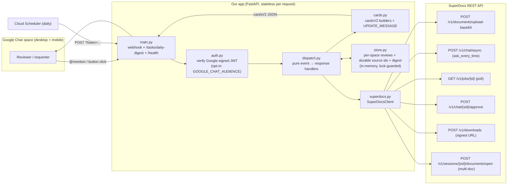

# SuperDocs for Google Chat — Architecture

One page. Render to PNG for Drive with any Mermaid tool (e.g. `mmdc -i
architecture.md -o architecture.png`) or the mermaid.live editor.

## Components & data flow



## Approval sequence (item-by-item → apply → download)

```mermaid
sequenceDiagram
  participant U as Reviewer (Chat)
  participant A as App (dispatch)
  participant S as SuperDocs

  U->>A: @mention "draft the renewal for Acme"
  A->>S: upload-base64 (seed / open prior doc as reference)
  A->>S: chat/async (approval_mode = ask_every_time)
  A->>S: poll job → awaiting_approval + pending_changes
  Note over A,S: warmup: first call may fail → retried once
  A->>S: downloads → real signed draft link
  A-->>U: summary card + item-by-item approval card

  U->>A: ✅ approve change 1  (CARD_CLICKED)
  A->>A: record decision in store
  A-->>U: UPDATE_MESSAGE (same card, ticked)
  U->>A: ❌ reject change 2
  A-->>U: UPDATE_MESSAGE (same card)

  U->>A: Apply decisions
  A->>S: approve (per-change array; undecided → rejected)
  A->>S: poll to completed → downloads
  A-->>U: result card + signed .docx link
```

## Legend / decisions
- **Human gate:** nothing applies until *Apply decisions*; each change carries its own
  Approve/Reject; undecided changes default to **rejected** (never apply unreviewed work).
- **Polling, not SSE:** avoids the `proposed_change_batch.content` double-parse trap;
  `parse_pending_changes()` still handles the double-encoded shape defensively.
- **Honest links:** `/v1/downloads` gives a genuine ~15-min signed URL (no fabricated
  share links; button omitted if the call fails).
- **Multi-document:** "using last year's" opens the prior doc as a reference tab and
  drafts a **new** document — the referenced doc is untouched.
- **Auth:** opt-in JWT verification via `GOOGLE_CHAT_AUDIENCE` (off for local dev).
- **State:** in-memory, per-space isolated, lock-guarded (concurrent-safe); a database
  is the documented production swap.
- **Tested:** 39 keyless tests exercise dispatch/cards/store/auth/main through a fake
  client — no network, no API key.
